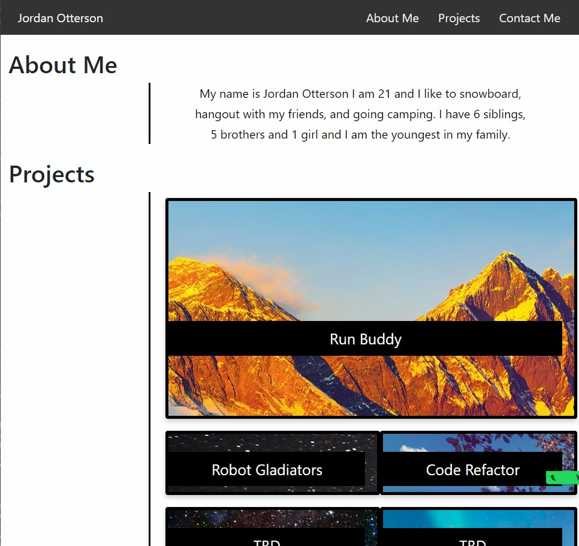

# Advanced-CSS-Challenge-Professional-Portfolio

## Description
Has my projects and contact info and about me so that when someone clicks on my portfolio they can see my work and how to contact me.
## What I learned
I learned how to create my portfolio using CSS and HTML

https://otterpop7.github.io/Advanced-CSS-Challenge-Professional-Portfolio/